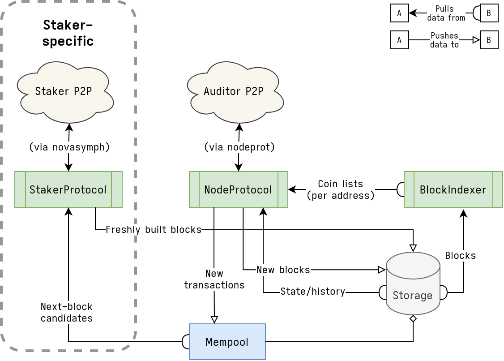

# themelio-node: Themelio's reference implementation

[](https://crates.io/crates/themelio-node)


[Themelio](https://themelio.org) is a new public blockchain focused on security, performance, and long-term stability. `themelio-node` is Themelio's reference implementation in Rust.

## Installation

For security reasons, until we have reliable reproducible build infrastructure, the only official distribution channel for `themelio-node` is its source code package on [crates.io](https://crates.io).

Fortunately, installing `themelio-node` from source is extremely easy. First, make sure [cargo](https://doc.rust-lang.org/cargo/getting-started/installation.html) is installed on your machine. Then, simply run

```
$ cargo install --locked themelio-node
```

This produces an executable `themelio-node` in `~/.cargo/bin/`, which should already be in your `$PATH`.

## Hardware Requirements

### Minimum:

- 1-core CPU
- 4GB of RAM
- at least 200GB of free storage (SSD not necessary)
- 10 Mbit/sec download Internet service

### Recommended:

- 4+ core CPU
- 16GB of RAM
- 200+GB of free storage on a fast device (SSD, RAID array, etc)
- 50+ Mbit/sec up/download Internet service

Full nodes replicate every consensus-confirmed block, validating its contents and ensuring network security while providing a local cache of the entire blockchain state. Running a full node helps contribute to the security and (read) performance of the network.

There are two kinds of full nodes:

- Auditor nodes comprise the vast majority of full nodes. They replicate and verify blocks but do not vote in consensus.
- Staker nodes, the ultimate guardians of Themelio security, have Sym locked up and participate in consensus. They are analogous to miners in proof-of-work blockchains like Bitcoin.

## Auditor Full Node

### On the Themelio Mainnet:

To run an auditor on the “mainnet” (which at the moment is far from stable, but does have a persistent history), just run:

```
$ themelio-node
```

`themelio-node` will then beginning synchronizing all the blocks in the blockchain. This will take quite a while (a day or so) and store a bunch of data in in `~/.themelio-node/`.

### On the Themelio Testnet:

To run the auditor on the non-persistent testnet, where most covenant development and testing will happen during the betanet period, run instead

```
$ themelio-node --bootstrap tm-1.themelio.org:11814 --testnet
```

Note that two things were needed to connect to the testnet:

- Connecting to a testnet bootstrap node (this is the first server your full node talks to)
- Specifying --testnet, to use testnet validation rules

#### Configurations

You can change the configuration of an auditor node with the following flags:

```
--bootstrap <bootstrap>...
            Bootstrap addresses. May be given as a DNS name [default: mainnet-bootstrap.themelio.org:11814]

--database <database>                        Database path [default: /tmp/themelio-mainnet]

--listen <listen>                            Listen address

--override-genesis <override-genesis>
            If given, uses this TOML file to configure the network genesis rather than following the known
            testnet/mainnet genesis
```

## Staker Full Node

### On the Themelio Mainnet:

WIP

### On the Themelio Testnet:

WIP

### Configuration

WIP

### Operating a Private Network

WIP

## Contributing

Thank you for considering contributing to the Themelio source code! We welcome all contributions from absolutely anyone on the internet.

For minor changes, simply fork, fix, and submit a pull request. If you want to propose a larger change, be sure to get in touch with our dev team on [Discord]() to make sure your change aligns with Themelio's overarching philosophy. This will likely save you a significant amount of time and effort, as well as speed up the review process of your change.

Finally, make sure your code adheres to the following guidelines:

- Your code must adhere to the official Rust [style guide](https://github.com/rust-dev-tools/fmt-rfcs/blob/master/guide/guide.md)
- Your code must be documented per the official Rust [documentation guidelines](https://rust-lang.github.io/api-guidelines/documentation.html)
- Pull requests must be based on and opened against the `master` branch
- Commit messages must be descriptive
- Any protocol changes (whether consensus-breaking or not) must start as a TIP (e.g. [TIP-101](https://github.com/themeliolabs/themelio-node/issues/87))

## License

The license of the project is the Mozilla Public License, version 2.

---

## Source code structure

`themelio-node` is a highly concurrent program where different tasks are done by separate _actors_, which are "active" structs that own background async tasks or threads. They concurrently run and communicate both with other actors and with "plain data" types like `Mempool`. They are represented as green boxes in the following diagram illustrating the _data flows_ of the whole program:



There are the following primary types in themelio-node:

- `NodeProtocol` is the **core node actor**. It implements the core auditor/full node logic: gossiping with other through the `melnet`-based auditor P2P network (via the `themelio-nodeprot` crate) to synchronize the latest blockchain state.
  - Pushes new blocks to `Storage`
  - Pushes new transactions to `Mempool`; they are only gossipped further if `Mempool` accepts them
  - Pulls data from `Storage` to gossip to other nodes
  - Pulls data from `BlockIndexer` to answer queries about coin lists (which coins do this address "own")
- `BlockIndexer` indexes "nonessential" information about blocks. It continually pulls blocks out of `Storage`, and indexes them, keeping track of information such as which coins do which address own.
- `Storage` encapsulates all persistent storage in the system. It is not an actor, so it does not initiate any data flows.
  - Stores data using `meshanina` (for sparse Merkle tree nodes) and `boringdb` (for blocks and other metadata)
  - `Mempool` is a non-persistent field that keeps track of _the most likely next block_. This is based on the existing blockchain state plus unconfirmed transactions seen in the network.
- `StakerProtocol` is the **core staker actor**, which is only started in staker mode. It runs the Streamlet consensus protocol (implemented in the `novasymph` crate) over a separate melnet P2P.
  - Pushes freshly finalized blocks, with their consensus proofs (a quorum of signatures), into `Storage` (where `NodeProtocol` will pick them up and gossip them)
  - When proposing a block, pulls a candidate from `Mempool`

## Metrics

Themelio Labs runs a worldwide network of Themelio full nodes --- `themelio-node` can also be compiled to report metrics for this network.

Read [here](Metrics.md).
